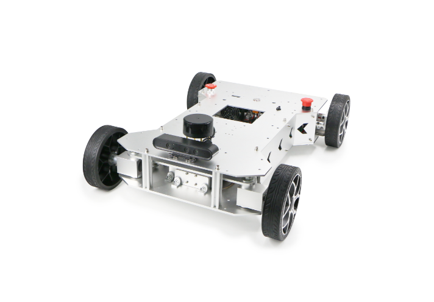
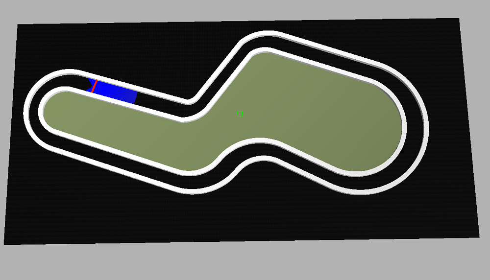
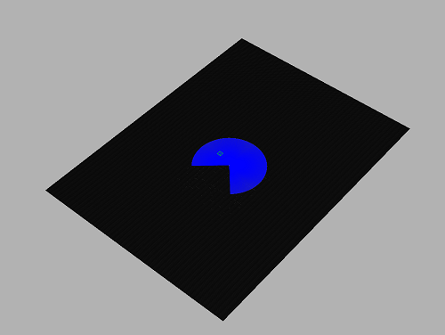
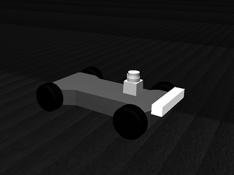

# Autonóm robotverseny Gazebo szimulátor

A versenyben használt szimulátor sok elemét az F1/10 car preojektből vettük át, természetesen a szoftver jogi oldalát tiszteletben tartva.

<p align="center">

</p>

## Build

```
sudo apt-get -y install ros-melodic-ros-control ros-melodic-gazebo-ros-control ros-melodic-ros-controllers ros-melodic-navigation qt4-default ros-melodic-ackermann-msgs ros-melodic-serial ros-melodic-teb-local-planner* ros-melodic-tf-conversions zip unzip ros-melodic-jsk-rviz-plugins python3-catkin-tools
```

```
cd to_your_catkin_workspace
catkin build racecar_gazebo racecar_control
```

## Run simulator

The current tracks are:
- Race track (`racecar.launch`)
- Empty track (`racecar_empty.launch`)
- SEM Nogaro autonomous track (`racecar_nog.launch`)


```
roslaunch racecar_gazebo racecar.launch
```

 

```
roslaunch racecar_gazebo racecar_empty.launch
```
 

```
roslaunch racecar_gazebo racecar_nog.launch
```
## Run control
```
roslaunch racecar_control cmd_vel_from_file.launch
```


### Acknowledgements

We are grateful to our friends and colleagues at the MIT RACECAR project for creating the F1/10 car model for Gazebo, and the F1/10 community for sharing insights on mapping, localization, and TEB-planner. We are also grateful to F1/10 Crew at Univerisity of Virginia: Dr. Madhur Behl and Varundev Suresh Babu.

